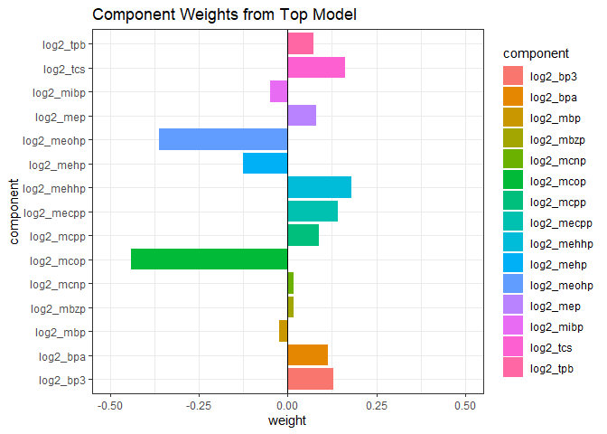
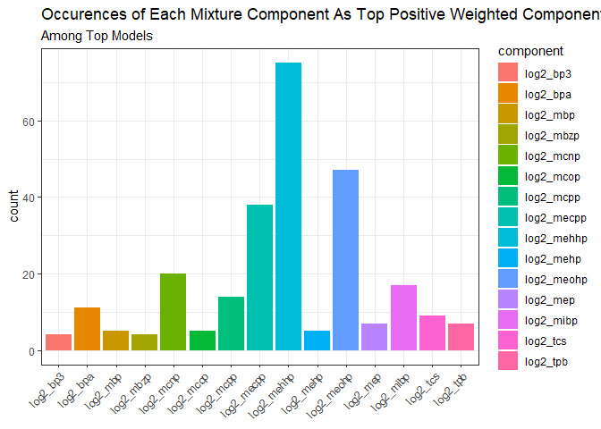
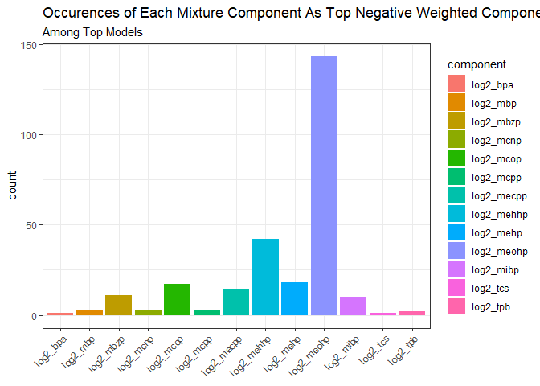

QGCompEWAS
================
Dennis Khodasevich (denniskhod@gmail.com)

# EWAS Quantile G-Computation User Guide

Instructions for running the EWAS application of Quantile G Computation.
Please refer to the [Quantile G Computation
paper](https://ehp.niehs.nih.gov/doi/full/10.1289/EHP5838) and [R
package](https://cran.r-project.org/web/packages/qgcomp/vignettes/qgcomp-vignette.html)
for more specific details regarding the standard quantile g-computation
function.  

## Background

Quantile g-computation estimates the parameters of a marginal structural
model that characterizes the change in the expected potential outcome
given a joint intervention on all exposures, conditional on confounders.
The general model structure is shown below:  

$$Y_i=\beta_0+\psi S_i + \beta_W\mathbf{W}$$  
Where:  

-   $\psi$ is the expected change in the outcome, given a one quantile
    increase in all exposures simultaneously  
-   $S_i$ is the exposure index, a summary measure incorporating the
    weights and effect size for each included quantized exposure. The
    exposure index can be further specified as  
    $$S_i = \sum_{j=1}^{d} \beta_jX_{j,i}$$

The interpretation of the overall mixture effect comes from the $\psi$
estimate and associated 95% confidence interval. Characterization of the
exposure index $S_i$ allows users to determine the mixture components
that are contributing most to the overall mixture effect. Quantile
g-computation is somewhat similar in interpretation to Weighted quantile
sum (WQS) regression, but without the restriction of directional
homogeneity and potential benefits in smaller sample sizes.  

ewas_qgcomp allows a large number of quantile g-computation models to be
efficiently run on a dataset containing many outcome variables (eg. DNA
methylation microarray data). The general process involves defining a
model structure involving a number of exposures and a set of
confounders, then running a quantile g-computation model using the
defined structure at each individual outcome, and saving the results of
each individual model.

------------------------------------------------------------------------

## Load Required Packages and Datasets

Firstly, load the required packages.  

``` r
# dependencies
require(tidyverse)                  # dataframe management and plotting
require(qgcomp)                     # running quantile g-computation
require(data.table)                 # dataframe management

# load EWAS QGComp functions
source("https://raw.githubusercontent.com/D-Khodasevich/QGCompEWAS/main/EWAS_QGComp_Functions.R")  
```

Then load the 2 required datasets:  
1. **pheno**: a dataframe containing exposure and covariate data  
2. **meth**: a dna methylation matrix with CpG sites as rows and
Individual Samples as columns. Rownames should reflect CpG name,
colnames should reflect sample ID. QGComp does not function with missing
data, so perform imputation or complete case subsetting prior to
analysis as necessary.  

``` r
dim(meth)         # random subset of 186804 CpG sites
```

    ## [1] 186804    310

``` r
head(rownames(meth), n=5)
```

    ## [1] "cg16389252" "cg19923810" "cg25096313" "cg16993975" "cg22114309"

``` r
dim(pheno)
```

    ## [1] 310  68

``` r
head(colnames(pheno[c(26:28, 63:65)]))
```

    ## [1] "log2_tcs" "log2_bp3" "log2_tpb" "NK"       "Bcell"    "Mono"

For this example, we are using a random subset of 186804 CpG sites from
a DNA methylation array dataset, and a collection of phthalate/phenol
measures as the mixture component. If using another data format for
meth, ensure the rownames of meth correspond to the appropriate ID
variable (eg miRNA or mRNA transcript ID).  

Prior to proceeding, ensure that the order of rows in pheno matches the
order of columns in meth.

``` r
# Ensure that the methylation and phenotype data are ordered identically
meth <- meth[, na.omit(match(pheno$ID, colnames(meth)))]
pheno <- pheno[match(colnames(meth), pheno$ID),]
ifelse(all(pheno$ID == colnames(meth)), 
       "meth and phenotype data successfully matched", 
       "Data not matched! Check what went wrong!")
```

    ## [1] "meth and phenotype data successfully matched"

## Defining Model Inputs

Define the quantile g computation model structure prior to running the
function.

-   **Xnm**: list of mixture components, named as they appear in the
    pheno dataframe.  
-   **covars**: list of covariates to adjust for, named as they appear
    in the pheno dataframe.

``` r
# specification of exposure mixture
### Xnm: list of mixture components
Xnm <- c("log2_bpa",  "log2_bp3" , "log2_tpb", "log2_tcs", "log2_mep", "log2_mbp", 
         "log2_mbzp", "log2_mcnp", "log2_mcop" , "log2_mcpp" , "log2_mecpp" , "log2_mehhp",
         "log2_mehp", "log2_meohp", "log2_mibp")      

# specification of covariates
covars = c("CD8T", "CD4T", "NK", "Bcell", "Mono", "Gran", "nRBC", "sex")
```

## Running EWAS QGComp

“ewas_qgcomp” is the primary function. Run ewas_qgcomp, specifying all
inputs and parameters.

**pheno**: matrix containing exposure and covariate data  
**meth**: dna methylation matrix with CpG sites as rows and Individual
Samples as columns

-   rownames should reflect CpG name, colnames should reflect sample
    ID  
-   order of rows in pheno must match order of rows in meth  

**mix_comp**: vector of mixture components, defined as “Xnm” above  
**covars**: covariates to adjust for, defined as covars above  
**mval_conversion**: whether to perform an m-value conversion on the
DNAm data. Default is FALSE, set to TRUE if input is a beta value
matrix  
**qval**: value of q for quantile g computation function. Default is 4  
**output_type**: whether to output only the mixture summary output or
include weight summaries as well.

-   basic: only output is the summary dataframe including probeID, psi,
    SE, CI, t-value, and p-value  
-   full: basic output plus complete mixture weight summaries (note:
    higher run time for greater mixture components)

``` r
# Running ewas_qgcomp with full output saved to ewas_qgcomp_fit
ewas_qgcomp_fit <- ewas_qgcomp(pheno = pheno, meth = meth, mix_comp = Xnm, covars = covars, 
                      mval_conversion=TRUE, qval=4, output_type="full")
```

Note: the progress bar is set to show completion every 5000 models
completed, this setting may be adjusted as necessary in the source code.

Specifying output_type=“full” for larger datasets (eg. EPIC array data
with a large mixture exposure set) may result in long runtime with large
data outputs. An alternative methodology may involve initially running
the function with output_type=“basic” and using the summary results (eg
a pre-defined p-value threshold) to subset the initial dataset, the
running the full EWAS QGComp function on this subset dataset.

------------------------------------------------------------------------

## EWAS QGComp Outputs

Specifying the basic output will produce a single dataframe consisting
of the standard qgcomp summary measures: “probeID”, “beta”, “se”,
“lowCI”, “upCI”, “pval”, “tval”

Specifying the full output will produce a list consisting of 3 objects:

-   *results*: standard qgcomp summary measures: “probeID”, “beta”,
    “se”, “lowCI”, “upCI”, “pval”, “tval”  
-   *pos_weights*: positive component weight summaries  
-   *neg_weights*: negative component weight summaries

``` r
results <- as.data.frame(ewas_qgcomp_fit$results)          # saving results to dataframe
pos_weights <- as.data.frame(ewas_qgcomp_fit$pos_weights)  # saving positive weights to dataframe
neg_weights <- as.data.frame(ewas_qgcomp_fit$neg_weights)  # saving negative weights to dataframe
```

``` r
results %>% 
  arrange(pval) %>% 
  head(n=6)
```

    ##      probeID      beta         se      lowCI      upCI         pval     tval
    ## 1 cg18713646 0.2383680 0.04750381 0.14526229 0.3314738 9.061286e-07 5.017872
    ## 2 cg00833614 0.1932829 0.04178761 0.11138071 0.2751851 5.610991e-06 4.625364
    ## 3 cg18080604 0.1173883 0.02580623 0.06680897 0.1679675 7.897981e-06 4.548834
    ## 4 cg06053605 0.1112029 0.02546943 0.06128375 0.1611221 1.753991e-05 4.366133
    ## 5 cg23693485 0.1315667 0.03027154 0.07223552 0.1908978 1.910379e-05 4.346216
    ## 6 cg04834749 0.1224804 0.02876839 0.06609535 0.1788654 2.784643e-05 4.257463

### Interpreting Weights

The negative and positive weights for each probeID should all add up
to 1. It is good practice to check this to ensure no problems occurred.

``` r
positive_check <- pos_weights %>% 
  group_by(probeID) %>% 
  summarize(n(), 
          sum(weight))
table(positive_check$`sum(weight)`)
```

    ## 
    ##      1 
    ## 186804

``` r
negative_check <- neg_weights %>% 
  group_by(probeID) %>% 
  summarize(n(), 
          sum(weight))
table(negative_check$`sum(weight)`)   
```

    ## 
    ##      1 
    ## 186804

Here we subset the positive and negative weight summaries to the top
identified probe.  

``` r
top_pos <- pos_weights %>% 
  filter(probeID == "cg18713646")
top_neg <- neg_weights %>% 
  filter(probeID == "cg18713646")
top_neg$weight <- top_neg$weight*(-1)

df <- rbind(top_pos, top_neg)

ggplot(df, aes(x=component, y=weight, fill=component)) + 
  geom_bar(stat="identity") + 
  theme_bw() + 
  scale_y_continuous(limits = c(-0.5,0.5)) + 
  geom_hline(yintercept = 0) + 
  coord_flip() + 
  ggtitle("Component Weights from Top Model")
```

<!-- -->

You may want also to examine which mixture components are most often
being heavily weighted among the top models.  
The code below filters to the CpG site models that had p values lower
than 0.001, then extracts the individual mixture components that
received the highest positive and highest negative weight in those
models. The number of occurrences of each component among these top
models is then plotted fror both the negatively and positively weighted
directions.

``` r
# filter to probeIDs below a certain p-value threshold
sig_probes <- results %>% 
  filter(pval < 0.001)
sig_probes <- unique(sig_probes$probeID)

pos <- pos_weights %>% 
  filter(probeID %in% sig_probes) %>% 
  group_by(probeID) %>% 
  filter(weight == max(weight)) %>% 
  ungroup() %>% 
  group_by(component) %>%   
  summarize(count = n())

ggplot(pos) + 
  geom_col(aes(x=component, y=count, fill=component)) + 
  theme_bw() + 
  xlab(NULL) + 
  theme(axis.text.x = element_text(angle = 45, vjust = 1, hjust=1)) + 
  labs(title = "Occurences of Each Mixture Component As Top Positive Weighted Component", 
       subtitle = "Among Top Models")
```

<!-- -->

``` r
neg <- neg_weights %>% 
  filter(probeID %in% sig_probes) %>% 
  group_by(probeID) %>% 
  filter(weight == max(weight)) %>% 
  ungroup() %>% 
  group_by(component) %>%   
  summarize(count = n())

ggplot(neg) + 
  geom_col(aes(x=component, y=count, fill=component)) + 
  theme_bw() + 
  xlab(NULL) + 
  theme(axis.text.x = element_text(angle = 45, vjust = 1, hjust=1)) + 
  labs(title = "Occurences of Each Mixture Component As Top Negative Weighted Component", 
       subtitle = "Among Top Models")
```

<!-- -->

## Bootstrap Version of EWAS QGComp

Bootstrapping is not feasible for large scale analysis. However, one can
use the outputs from the non-bootstrapped version to subset to a smaller
set of significant/suggestive to rerun with boostrapped estimates. If
the number of significant probes is sufficiently low, you can
alternatively choose to run individual “qgcomp.boot” functions.

``` r
# vector of 25 probes with p value < 0.0001
sublist <- results %>% 
  filter(pval < 0.0001)
sublist <- sublist$probeID

# subsetting original meth dataframe to those 25 probes
meth_sub <- meth[rownames(meth)%in%sublist, ]
```

“ewas_qgcomp_fit.boot” is the bootstrap extension of “ewas_qgcomp”  
Model specification is done the same way, with the addition of Bval (the
number of bootstraps to perform) and seedval (set.seed value).

``` r
# specification of exposure mixture
### Xnm: list of mixture components
Xnm <- c("log2_bpa",  "log2_bp3" , "log2_tpb", "log2_tcs", "log2_mep", "log2_mbp", 
         "log2_mbzp", "log2_mcnp", "log2_mcop" , "log2_mcpp" , "log2_mecpp" , "log2_mehhp",
         "log2_mehp", "log2_meohp", "log2_mibp")      

# specification of covariates
covars = c("CD8T", "CD4T", "NK", "Bcell", "Mono", "Gran", "nRBC", "sex")

# Running ewas_qgcomp with full output saved to ewas_qgcomp_fit
ewas_qgcomp_fit.boot <- ewas_qgcomp.boot(pheno = pheno, meth = meth_sub, 
                           mix_comp = Xnm, covars = covars, mval_conversion=TRUE, 
            qval=4, output_type="full", Bval=1000, seedval=1234)
```

The output of “ewas_qgcomp_fit.boot” will consist of a results dataframe
structured similarly to the noboot version. If the full output is
specified, an additional dataframe “component_effects” will be produced.
Unlike the noboot version, “component_effects” will contain both the
positive and negative effect estimates from each model. The sum of all
individual component effect sizes will sum to the overall mixture
effect.
